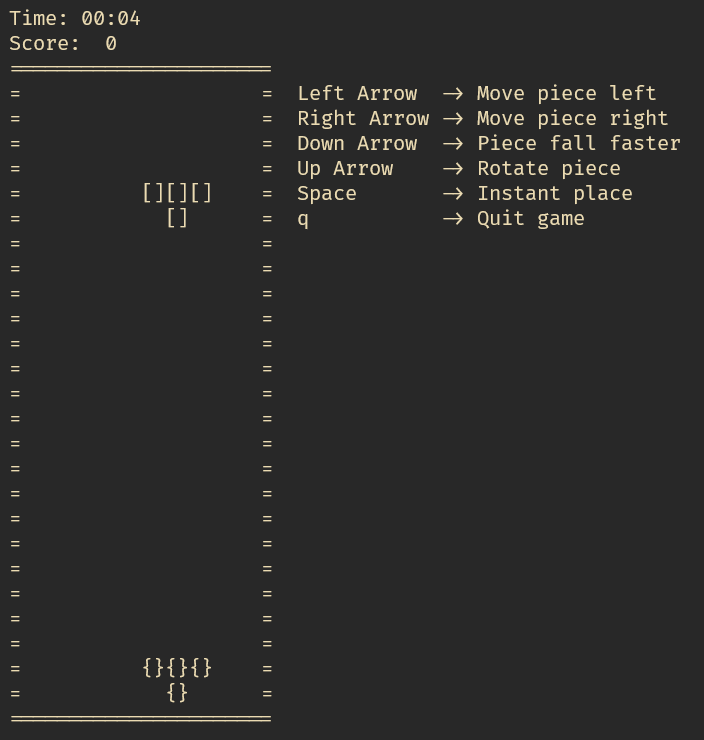
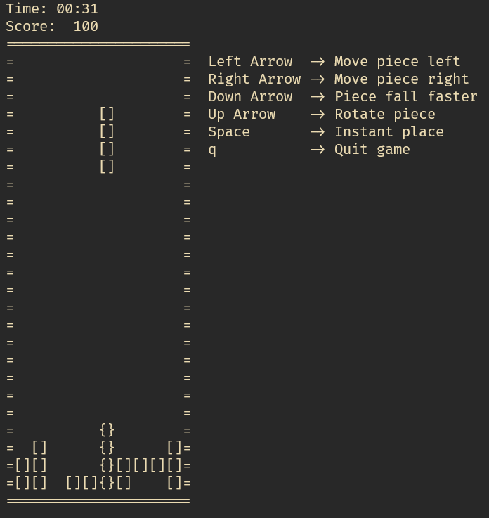

# TermTris

Simple shape placing game that can be played entirely in the terminal.

You can overwrite any config from config.go by using a JSON file (see configs.example.json) and
then running it as follows.

`.\TermTris.exe --config ./configs.example.json`

# Images

